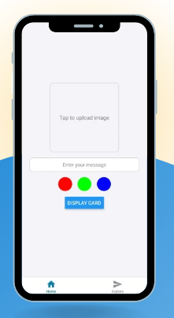
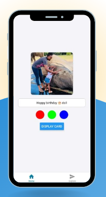
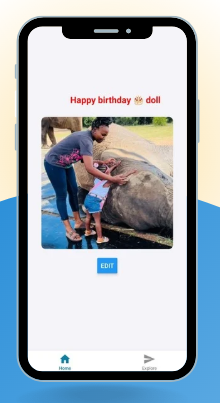

# Birthday Card App

This is a **Birthday Card Application** that allows users to create custom birthday cards with personalized text, images, and decorations.

## Features

### Card Creation:
1. **Custom Birthday Cards:**
   - Users can design unique birthday cards.
   - Add personal messages and images.
   
2. **Text Editing:**
   - Add, edit, and format text on the card.
   - Choose different fonts, colors, and styles.
   
3. **Decorations:**
   - Enhance cards with stickers, borders, and other design elements.

## Technology Stack
- **Frontend:** React / React Native
- **Styling:** CSS / Tailwind
- **Storage:** Local Storage / Cloud Storage (Optional)

## Installation

To run this project locally, follow these steps:

1. Clone the repository:
   ```bash
   git clone https://github.com/your-username/birthday-card-app.git
   ```
2. Navigate to the project directory:
   ```bash
   cd birthday-card-app
   ```
3. Install dependencies:
   ```bash
   npm install
   ```
4. Start the application:
   ```bash
   npm start
   ```

## Screenshots





## License
This project is licensed under the MIT License.


